# Mini Math Game

## Overview

Mini Math Game is an educational platform designed to enhance the arithmetic and logical skills of primary school students through interactive games and quizzes. The project is built using Django for the game interface and Directus as the CMS for administrative functions. PostgreSQL is used as the game database and MongoDB is used for session management. The game supports quick deployment using Docker.

---

## Features

- **Dynamic game questions**: Teacher or admin can create and assign game dynamically based on a game type and a difficulty level.
- **Admin dashboard**: This project utilised Directus CMS functionality which enabled admin to:
  - manage game content
  - monitor player information and progress
  - create new user and assign to specific role with permissions

## Project technologies

- **Frontend**:
  - [](https://developer.mozilla.org/en-US/docs/Web/HTML)
  - [](https://developer.mozilla.org/en-US/docs/Web/CSS)
  - [](https://developer.mozilla.org/en-US/docs/Web/JavaScript)
- **Backend**:
  - [](https://www.djangoproject.com/)
- **Admin Dashboard**:
  - [](https://directus.io/)
- **Database**:
  - [](https://www.mongodb.com/)
  - [](https://www.postgresql.org/)

---

## System requirements

- **Python**: Version 3.10 or above.
- **Docker**: Latest version recommended.
- **RAM**: Minimum of 4GB (8GB recommended).
- **Disk Space**: 500MB or more.
- Ensure that Docker and Docker Compose are correctly installed and running before
proceeding to the installation.

---

## Installation

1. Clone the repository:
   ```bash
   git clone https://github.com/pisethchhom/Mini-Math-Game.git
   cd Mini-Math-Game
   ```
2. Create .env file:
   ```bash
   cp .env.example .env
   ```
3. Create docker-compose file:
   ```bash
   cp docker-compose-sample.yml docker-compose.yml
   ```
4. Reset to default game data (Optional):
   ```bash
   make reset
   ```
5. Start the project using docker compose:
   ```bash
   docker-compose up -d
   ```

---

## Start the game

- **Game Url**: http://localhost:8000
- **Admin Dashboard (Directus)**: http://localhost:8055
  - Default email: admin@example.com
  - Default password: 123123123
- **Mongo Express Dashboard**: http://localhost:8081
  - Default username: admin
  - Default password: admin_pw
 
---

## Stop the project

1. Run:
   ```bash
   docker-compose down
   ```

---

## Images
### Project Architecture
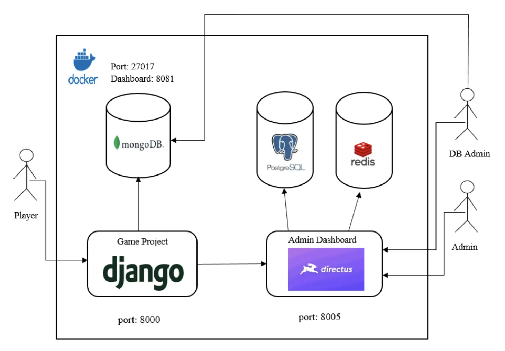

### Gameplay Screens
<div style="display: flex; flex-wrap: wrap; gap: 10px; justify-content: center;">
  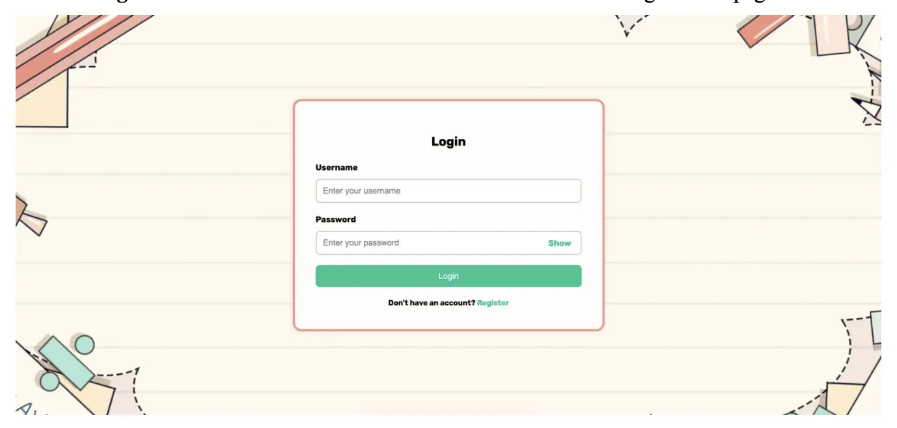
  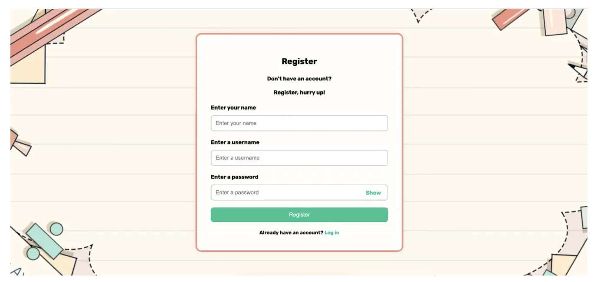
  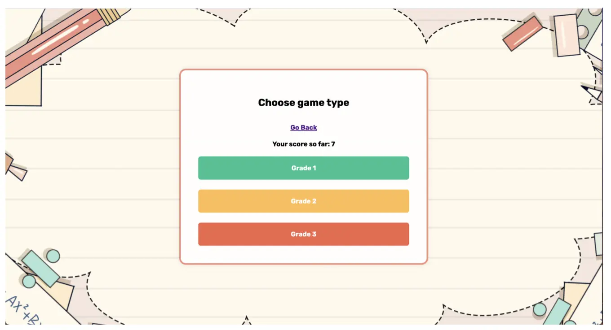
  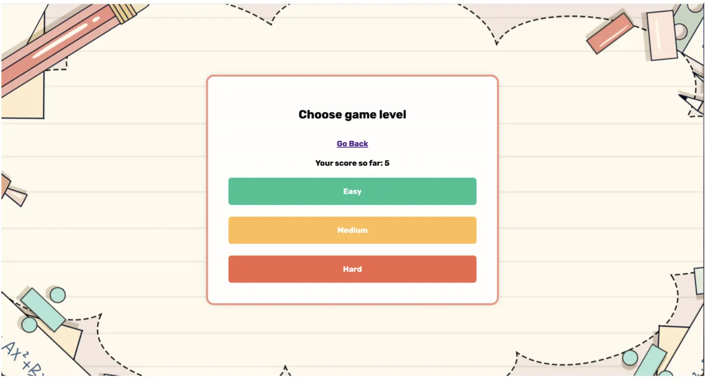
  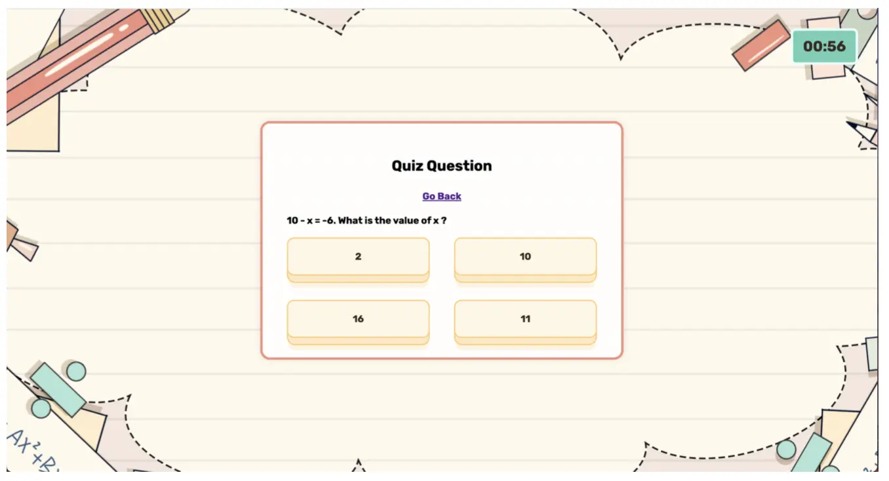
  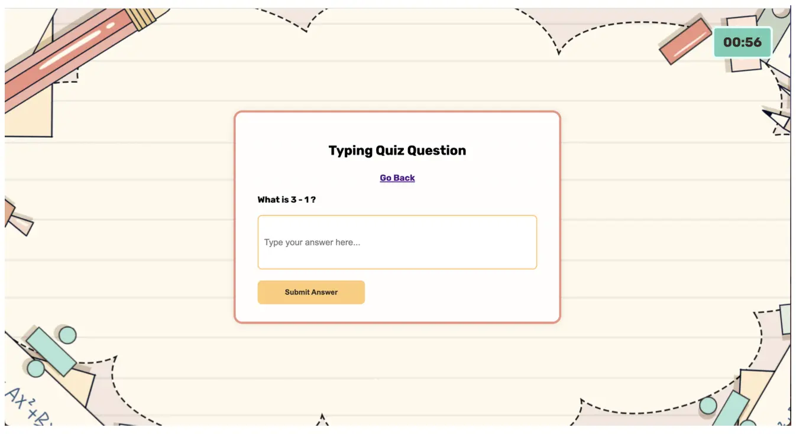
</div>

### Admin Dashboard
<div style="display: flex; flex-wrap: wrap; gap: 10px; justify-content: center;">
  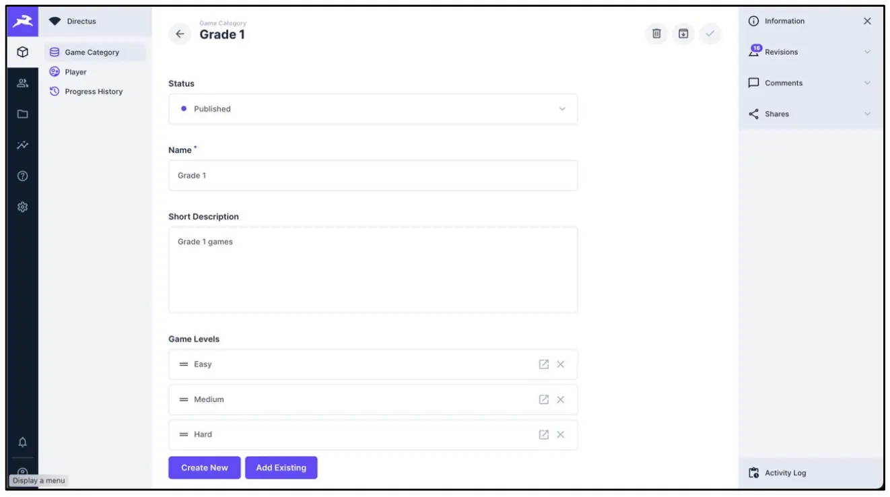
  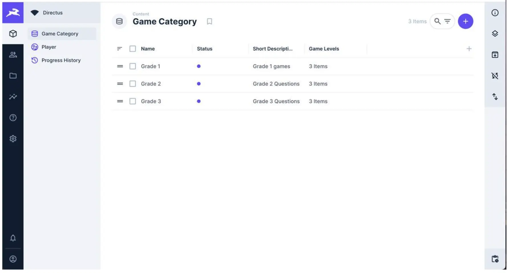
  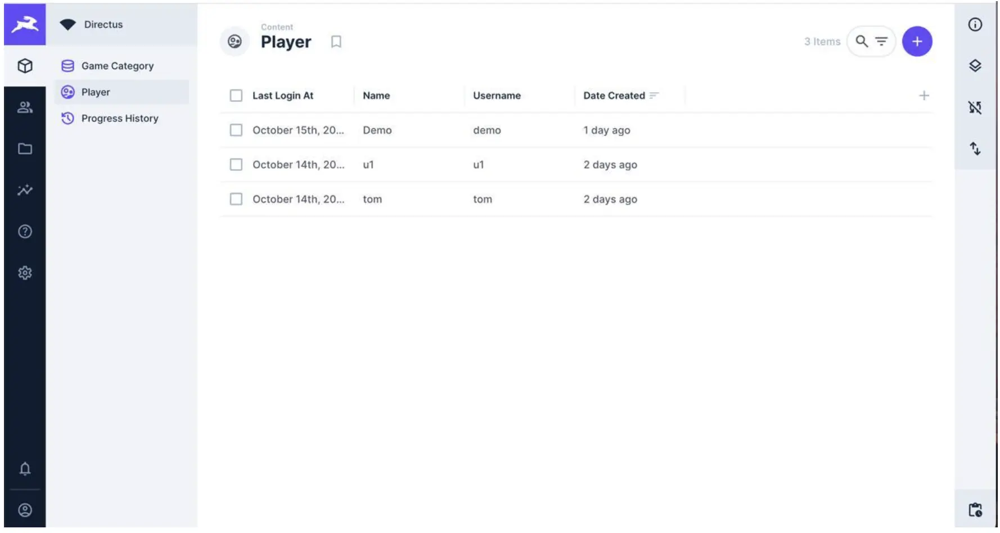
  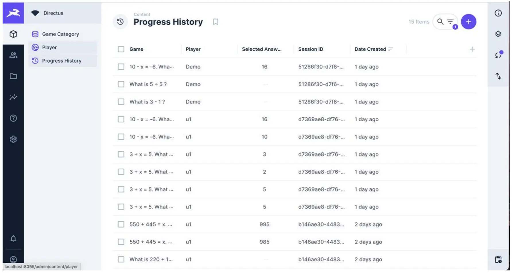
</div>

### Mongo Express
<div style="display: flex; flex-wrap: wrap; gap: 10px; justify-content: center;">
  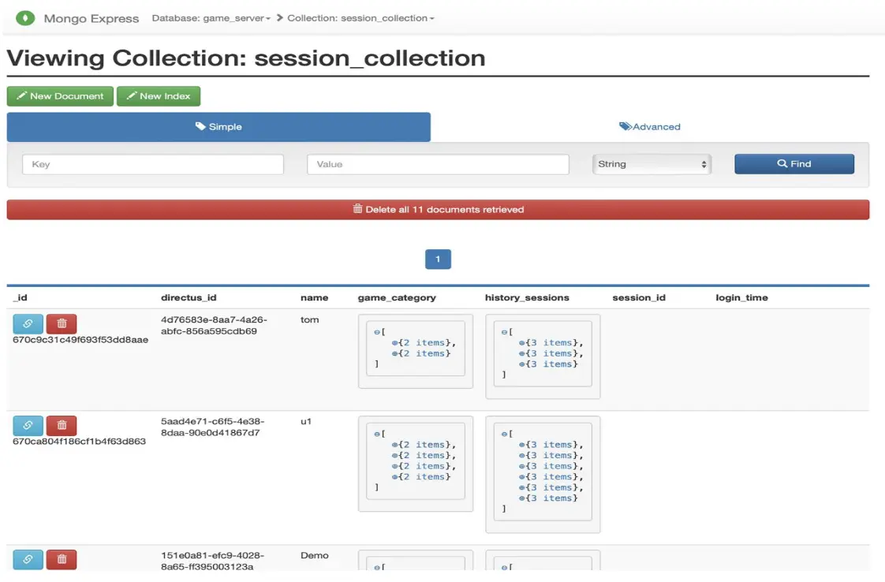
  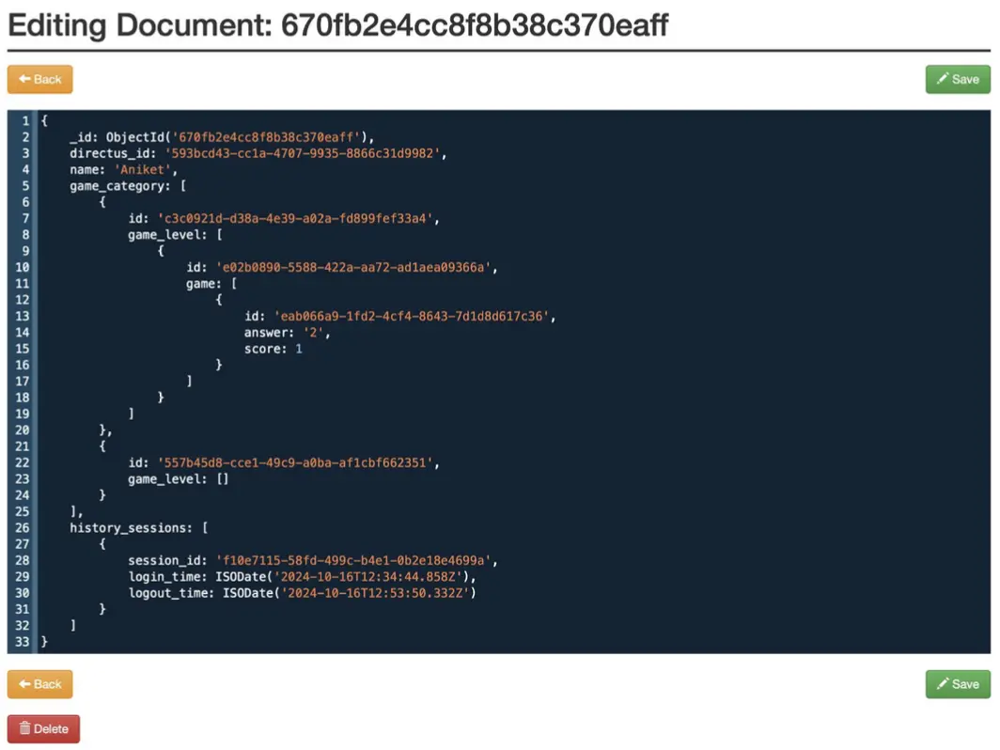
</div>

---

## License

This project is licensed under the MIT License. See the LICENSE file for details.

